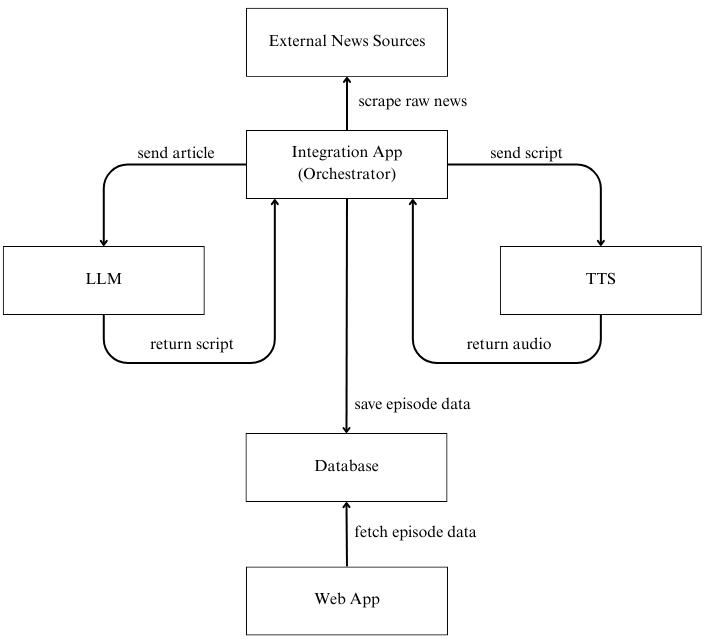
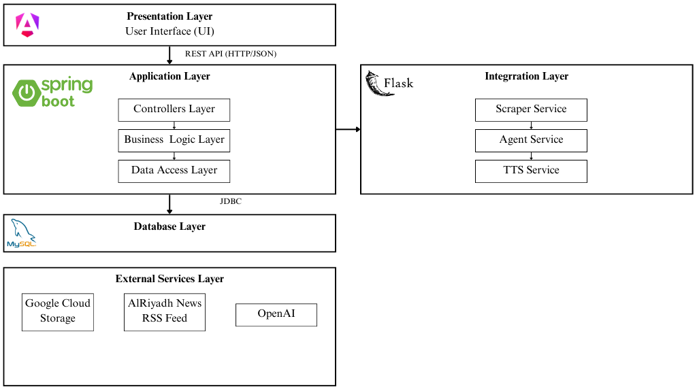

# 3ulum-Alyawm

A Spring Boot backend service for a podcast episodes platform that transforms daily news from newspaper sources into AI-generated audio content in the Najdi dialect. The platform leverages Agentic AI with LLM capabilities to process and structure news articles, then converts them into high-quality audio episodes using TTS technology, making news consumption accessible through listening rather than reading.
## Table of Contents
- [System Components](#system-components)
  - [Backend (Spring Boot)](#backend-spring-boot)
  - [Frontend (Angular)](#frontend-angular)
  - [Python Agent Integration App](#python-agent-integration-app)
  - [Python TTS Fine-tuning App](#python-tts-fine-tuning-app)
- [System Architecture](#system-architecture)
- [Getting Started](#getting-started)
  - [Prerequisites](#prerequisites)
  - [Configuration](#configuration)
  - [Run Locally](#run-locally)
- [Docker](#docker)

## System Components
The diagram below illustrates the high-level workflow and component interaction, specifically detailing the content generation pipeline from raw news to the final audio episode delivered to the user.


### Backend (Spring Boot)
The core REST API service built with Spring Boot that handles.<br/>
**Key features**:
- Models/Entities: Audio, Article, Episode, EpisodeProgress, Rating, Role, User `(located in src/main/java/com/yourdomain/models/)`
- Controllers: REST endpoints for CRUD operations `(located in src/main/java/com/yourdomain/controllers/)`
- Services: Business logic layer `(located in src/main/java/com/yourdomain/services/)`
- Repositories: JPA data access layer `(located in src/main/java/com/yourdomain/repositories/)`
- Configuration: Application settings in `src/main/resources/application.properties`

Key features include user authentication, episode management, rating system, and cloud storage path references for AI-generated content.

### Frontend (Angular)
The user interface is built using Angular. It provides a rich, single-page application experience for users to browse, play, and rate episodes. The frontend consumes the RESTful APIs exposed by this Spring Boot backend.<br/>
**Key features**:
- Home page displaying daily news episodes
- Episodes list, showing all episodes
- User profile with listening statistics and history
- Responsive design for seamless user experience

**Repository**: [Arabic_News_Podcast-FE](https://github.com/Rmsaah/Arabic_News_Podcast-FE)

### Python Agent Integration App
**Key features**:
- Generates script content for podcast episodes 
- Generates audio from generated episode script 
- Agentic AI governing the content generation process 
- Integrates via REST API

**Repository**: [tts-agent-project](https://github.com/madaweehath/tts-agent-project)

### Python TTS Fine-tuning App
Fine-tuning codebase for training the Text-to-Speech model on the Najdi dialect.<br/>
**Key features**:
- Contains training scripts for XTTSv2 model fine-tuning
- Used during development phase to create the TTS model deployed in production

**Repository**: [Najdi-XTTS-v2](https://github.com/wasanalmansour480-oss/Najdi-XTTS-v2)

## System Architecture
This project follows the MVC (Model-View-Controller) architecture pattern with a clear separation between backend and frontend.



The backend exposes RESTful endpoints consumed by the Angular frontend, manages podcast episodes, user profiles, and integrates with Python-based AI models for content generation.

## Getting Started
### Prerequisites
- Java Development Kit (JDK): Version 17 or higher
- Maven: Build automation tool
- MySQL: Version 8 or higher 
- Docker: For containerization (optional but recommended)
- Git: Version control

### Configuration
The backend is configured using environment variables.
1. **Clone the repository:**
```
git clone https://github.com/yourusername/3ulum-alyawm-backend.git
cd 3ulum-alyawm-backend
```
2. **Configure Database Connection** in `src/main/resources/application.properties`
```
spring.datasource.url=jdbc:mysql://${MYSQL_HOST}:${MYSQL_PORT}/${MYSQL_DATABASE}
spring.datasource.username=${MYSQL_USERNAME}
spring.datasource.password=${MYSQL_PASSWORD}
```
3. **Configure Python Service Endpoint** in `src/main/resources/application.properties`
```
agent.base.url=${AGENT_BASE_URL:http://localhost:8001/api}
```

### Run Locally
**Using Maven**
```
./mvnw clean install
./mvnw spring-boot:run
```

## Docker
The project includes a Dockerfile for easy containerization of the Spring Boot backend service.
1. **Build the Docker Image**
```
docker build -t 3ulum-alyawm-backend .
```
2. **Run the Docker Container**
```
docker run -d -p 8080:8080 --name 3ulum-alyawm --env SPRING_DATASOURCE_URL='your_external_db_url' 3ulum-alyawm-backend
```
>[!NOTE]  
> You must properly set environment variables (e.g., database connection strings) when running in Docker, especially for external services.
